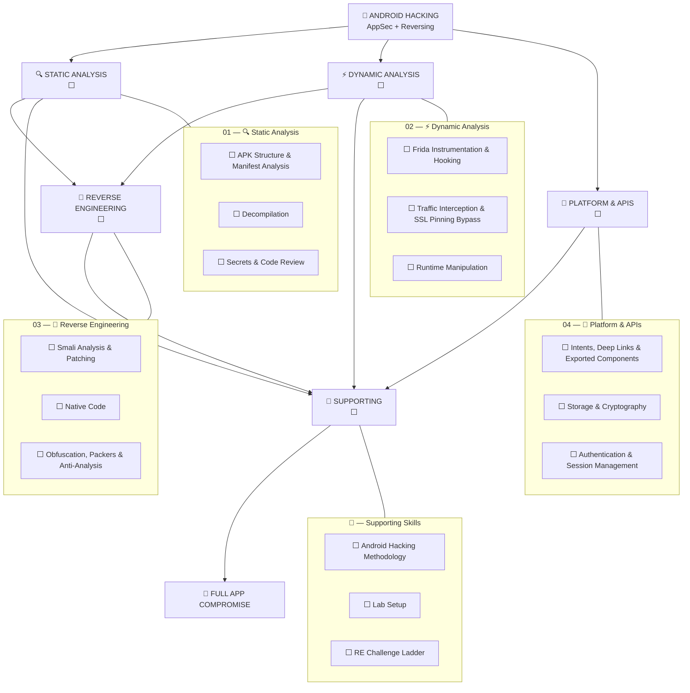

# 📱 Android Hacking

> My structured path to Android app security — static analysis, dynamic instrumentation, reverse engineering.
>
> Four domains → individual techniques → technical notes → practical labs → full app compromise.

> [⬅ My Hacking Hub](https://github.com/romeo-mhakayakora/Hacking-Hub) · [🤖 AI-Hacking](https://github.com/romeo-mhakayakora/AI-Hacking) · [🔌 API-Hacking](https://github.com/romeo-mhakayakora/API-Hacking)

---

## 🗺️ Android Hacking Map

> Every node below is clickable — it takes you directly to its notes.



### Legend

| Status | Meaning |
|--------|---------|
| ✅ | Technique mastered + notes written |
| 🔄 | Currently practicing |
| ⬜ | Not started |
| 🔁 | Needs review / practical reinforcement |

---

## 📊 Overall Progress

| Domain | MASVS Coverage | Status | Entry Point |
|--------|:--------------:|:------:|-------------|
| 🔍 Static Analysis | CODE, STORAGE | ⬜ | [Open →](./01-static-analysis/) |
| ⚡ Dynamic Analysis | NETWORK | ⬜ | [Open →](./02-dynamic-analysis/) |
| 🔧 Reverse Engineering | RESILIENCE | ⬜ | [Open →](./03-reverse-engineering/) |
| 📱 Platform & APIs | PLATFORM, STORAGE, AUTH | ⬜ | [Open →](./04-platform-apis/) |
| 🧰 Supporting Skills | — | ⬜ | [Open →](./supporting/) |

---

---

## 01 — 🔍 Static Analysis

> Reading the app without running it: structure, manifest, decompiled code, secrets. → [Domain README](./01-static-analysis/README.md)

| Module | MASVS | Status | Notes |
|--------|:-----:|:------:|:-----:|
| [APK Structure & Manifest Analysis](./01-static-analysis/apk-structure-manifest.md) | MASVS-CODE | ⬜ | [📖](./01-static-analysis/apk-structure-manifest.md) |
| [Decompilation (jadx, apktool)](./01-static-analysis/decompilation.md) | Technique | ⬜ | [📖](./01-static-analysis/decompilation.md) |
| [Secrets & Code Review](./01-static-analysis/secrets-code-review.md) | MASVS-STORAGE | ⬜ | [📖](./01-static-analysis/secrets-code-review.md) |

---

## 02 — ⚡ Dynamic Analysis

> Running the app under observation: hooks, traffic, runtime manipulation. → [Domain README](./02-dynamic-analysis/README.md)

| Module | MASVS | Status | Notes |
|--------|:-----:|:------:|:-----:|
| [Frida Instrumentation & Hooking](./02-dynamic-analysis/frida-instrumentation.md) | Technique | ⬜ | [📖](./02-dynamic-analysis/frida-instrumentation.md) |
| [Traffic Interception & SSL Pinning Bypass](./02-dynamic-analysis/traffic-interception.md) | MASVS-NETWORK | ⬜ | [📖](./02-dynamic-analysis/traffic-interception.md) |
| [Runtime Manipulation (Objection)](./02-dynamic-analysis/runtime-manipulation.md) | Technique | ⬜ | [📖](./02-dynamic-analysis/runtime-manipulation.md) |

---

## 03 — 🔧 Reverse Engineering

> Going deep: smali, native ARM code, obfuscation and anti-analysis. → [Domain README](./03-reverse-engineering/README.md)

| Module | MASVS | Status | Notes |
|--------|:-----:|:------:|:-----:|
| [Smali Analysis & Patching](./03-reverse-engineering/smali-analysis.md) | MASVS-RESILIENCE | ⬜ | [📖](./03-reverse-engineering/smali-analysis.md) |
| [Native Code (ARM/NDK) Reversing](./03-reverse-engineering/native-arm.md) | MASVS-RESILIENCE | ⬜ | [📖](./03-reverse-engineering/native-arm.md) |
| [Obfuscation, Packers & Anti-Analysis](./03-reverse-engineering/obfuscation-packers.md) | MASVS-RESILIENCE | ⬜ | [📖](./03-reverse-engineering/obfuscation-packers.md) |

---

## 04 — 📱 Platform & APIs

> Android-specific attack surface: components, storage, crypto, auth. → [Domain README](./04-platform-apis/README.md)

| Module | MASVS | Status | Notes |
|--------|:-----:|:------:|:-----:|
| [Intents, Deep Links & Exported Components](./04-platform-apis/intents-deeplinks.md) | MASVS-PLATFORM | ⬜ | [📖](./04-platform-apis/intents-deeplinks.md) |
| [Storage & Cryptography](./04-platform-apis/storage-crypto.md) | MASVS-STORAGE | ⬜ | [📖](./04-platform-apis/storage-crypto.md) |
| [Authentication & Session Management](./04-platform-apis/auth-session.md) | MASVS-AUTH | ⬜ | [📖](./04-platform-apis/auth-session.md) |

---

## 🧰 — Supporting Skills

> Methodology and lab setup supporting all Android attacks. → [Domain README](./supporting/README.md)

| Module | MASVS | Status | Notes |
|--------|:-----:|:------:|:-----:|
| [Android Hacking Methodology](./supporting/methodology.md) | — | ⬜ | [📖](./supporting/methodology.md) |
| [Lab Setup (Emulator, Root, Tooling)](./supporting/lab-setup.md) | — | ⬜ | [📖](./supporting/lab-setup.md) |
| [RE Challenge Ladder](./supporting/re-challenge-ladder.md) | — | ⬜ | [📖](./supporting/re-challenge-ladder.md) |


## 🧭 Suggested Order

```text
APK Structure & Manifest
      ↓
Decompilation
      ↓
Traffic Interception
      ↓
Frida Hooking
      ↓
Smali Patching
      ↓
Native / Obfuscation
      ↓
Platform APIs
```

## ✅ Readiness

A technique counts as mastered when I can explain it, execute it against an unfamiliar app, troubleshoot failures, document evidence, and chain it with other techniques.

---

[⬆ Back to top](#-android-hacking)
